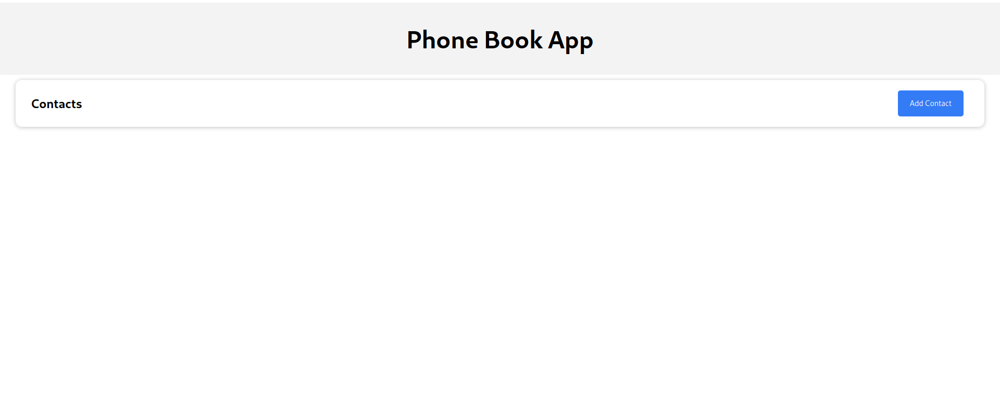
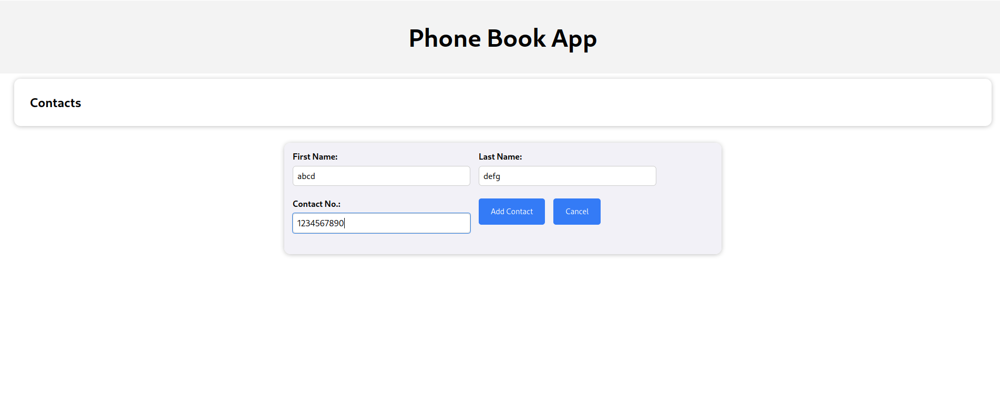
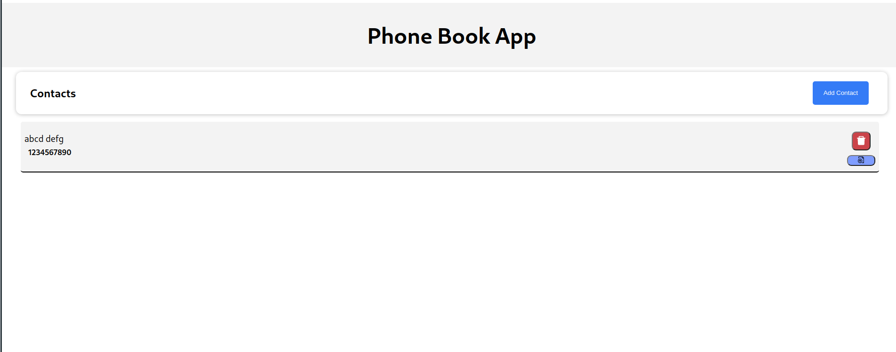

# <a href="https://resplendent-rugelach-4e647e.netlify.app/">PhoneBook</a>
### It is a simple Web App that is made using <a href="https://github.com/Shivang-Agarwal11/phonebook-bkcd">NodeJs</a> and ReactJs.
#### Here are few Snapshots :

 

 

 

 
